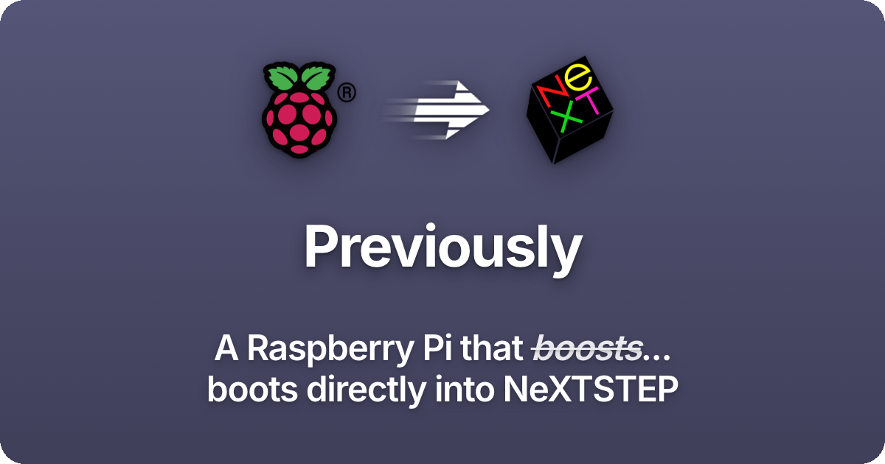

<div align="center">

[](https://github.com/phranck/previously/releases)
[](https://github.com/phranck/previously/actions)
[](https://layered.mit-license.org)
[](https://github.com/phranck/previously/commits/main)
[](https://github.com/phranck/previously)
[](https://github.com/phranck/previously)



</div>

# Previously

A Raspberry Pi 5 that starts straight into NeXTSTEP. No desktop behind it, no login to get past, nothing on the screen but the grey NeXT panel. The emulator underneath is [Previous](https://previous.nextcommunity.net/), and the machine it pretends to be is a NeXTcube from 1993.

One line sets all of it up, and afterwards a web admin takes over that looks like the machine it configures.

## Installing it

You need a Raspberry Pi 5 with a card imaged with Raspberry Pi OS Lite, 64 bit, based on Debian 13. On the Pi, over SSH:

```bash
curl -fsSL https://previous.li/install.sh | bash
```

That is the whole of it. When it finishes it says where the admin is, which is `http://<your-pi>.local:8810`, and how to read the token it asks for once.

Everything the script does, it writes down how to undo. Press Ctrl+C and it puts the machine back the way it found it.

## The admin

Machines, drives and displays are things you pick rather than values you type. Complete configurations move by drag and drop, and any of them can be changed and kept as your own. It answers on the network, so the Pi never needs a keyboard of its own.

None of it is approximated: the icons are the original files out of a NeXTSTEP 3.3 disk image, the window buttons are cut pixel for pixel out of the running system, and every colour, edge and raster is measured off it.

## More

- [previous.li](https://previous.li/) is the page this installs from.
- [Running it](docs/running-it.md) covers the rest: what the script touches, how to check the result, how to update the emulator and the admin, and how to get back into a machine whose screen now belongs to a NeXT.

## Thanks

To Andreas Grabher and everyone on [Previous](https://previous.nextcommunity.net/), without whom none of this would run at all.

NeXT, NeXTSTEP, OPENSTEP and the NeXT cube logo are registered trademarks of Apple Computer, Inc. The Raspberry Pi mark belongs to Raspberry Pi Ltd. Neither of them has anything to do with this project, and neither the marks nor the icons taken from a NeXTSTEP disk image are covered by the licence below.

## License

This repository has been published under the [MIT](https://layered.mit-license.org) license.
